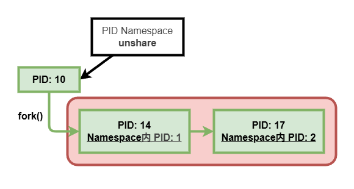
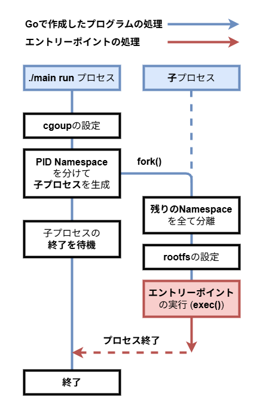

# 3-4. PID Namespaceとfork

さあ、いよいよ3章の大詰め、**PID Namespace**です。  
(UTC、Mount、PID以外のNamespaceは、**効果を確かめにくい**ため今回は扱いません)

## PID Namespaceを分けてみる

PID Namespaceは非常に強力なNamespaceで、**プロセスIDの採番をやり直す**と共に、**Namespace外のプロセスを見えない**状態にします。  
PID Namespaceを分けると**Namespace内のinitプロセス (PID: 1)** が作られ、そこをルートとした新しいプロセスIDの採番がなされます。

ひとまず先程までと同じ要領でNamespaceを分けてみましょう！

### 想定解答

:::details 想定解答

```go
// runサブコマンド
func runCommand(c Config) error {
  // cgroupの設定
  if err := SetupCgroup(c.Name, os.Getpid(), c.Cgroup); err != nil {
    return errors.WithStack(err)
  }

  // Namespaceを分離
  if err := unix.Unshare(unix.CLONE_NEWUTS | unix.CLONE_NEWNS); err != nil { // [!code --]
  if err := unix.Unshare(unix.CLONE_NEWUTS | unix.CLONE_NEWNS | unix.CLONE_NEWPID); err != nil { // [!code ++]
    return errors.WithStack(err)
  }

  // rootfsの設定
  if err := SetupRootfs(c.Rootfs); err != nil {
    return errors.WithStack(err)
  }

  // 作成した簡易コンテナ内でエントリーポイントを実行
  path, err := exec.LookPath(c.EntryPoint[0])
  if err != nil {
    return errors.WithStack(err)
  }
  if err := unix.Exec(path, c.EntryPoint, os.Environ()); err != nil {
    return errors.WithStack(err)
  }

  return nil
}
```

:::

## 一筋縄ではいかないPID Namespace

それではコンテナを起動してみましょう。  
Namespaceの分離には**root権限が必要**なので、`sudo su`を実行して**rootになってからプログラムを実行**して下さい。

```console
$ sudo su
# make run
go build -o main *.go
./main run bash
```

...おそらくどの環境でも**何かしらのエラー**が出たかと思います。  
特にDev Containerで取り組んでいる皆さんは、以下のようなエラーが高速で繰り返し表示されたはずです (`ctrl(cmd) + c`を長押しで止まる時がありますが、止まらなければ**PIDを調べてkill**するか**Dev Containerを再起動**して下さい)。

```plaintext
bash: fork: Cannot allocate memory
bash: cannot make pipe for command substitution: Too many open files
```

運良く起動できた方は、**PIDの採番**がやり直されているか確かめてみましょう。

```console
$ sudo su
# make run
go build -o main *.go
./main run bash
bash: fork: Cannot allocate memory
# echo $$
184720
#
```

どうやらPIDも**振り直されてなさ**そうです。  
[3-1](/3-namespace/1-os-exec-syscall/#今のコードの挙動を見る)と同様にプロセスツリーを表示すると、`echo $$`で表示されたPIDはホスト側のPIDで、**PIDが振り直されていない**ことがわかります (プロセスツリーの確認時は、`sudo su`**した後のシェル**で`pstree`に入れるPIDを取得するのがおススメです)。

::: tip 挙動確認用シェル

```plaintext
Every 1.0s: pstree -p 184552

bash(184552)---make(184719)---bash(184720)
```

:::

これは想定内の挙動であり、PID Namespaceの**特殊な仕様**によるものです。

## PID Namespaceの特殊仕様

PID Namespaceは、**分離してから子プロセスを生成**しないと正しく動かない仕様になっています。  
Namespaceを分離した後、生成された子プロセスが**Namespace内のinitプロセス (PID: 1)** になります。



Linuxの都合上、生成されたプロセスの**自認しているPIDを後から変更するのが不可能**なため、このような仕様になっているそうです。

## PID Namespaceを正しく実装する

では、PID Namespaceを**正しく**動かしてみましょう！  
以下フローチャートのような処理の流れを実装して下さい。



:::details ヒント1
子プロセスを生やしたいときは`os/exec.Cmd`が使えましたね！  
今回は**新しいサブコマンド**を作った上で、`os/exec.Cmd`を用いて**自分自身のサブコマンド**を呼び出すという方法が最適解のはずです。
:::

:::details ヒント2
`/proc/self/exe`は、常に**自分自身のバイナリ**を指します。
:::

:::details ヒント3
Go側の都合で、PID Namespaceを**分離した後にexec.Cmdの実行はできません**！

`exec.Cmd`には`SysProcAttr`という[`*unix.SysProcAttr`](https://pkg.go.dev/syscall#SysProcAttr)型のフィールドがあります。  
この中の`Cloneflags`というフィールドに`unix.Unshare()`に渡したのと同じ`flags`を渡すと、子プロセスを生成する際`flags`で指定した**Namespaceを分けながら**生成してくれます。
:::

### 想定解答

:::details 想定解答

```go
func main() {
  // ～～～～～～～省略～～～～～～～

  // 指定されたサブコマンドの実行
  switch os.Args[1] {
  case "run":
    if err := runCommand(c); err != nil {
      log.Fatalln(errors.StackTraces(err))
    }

  case "init": // [!code ++]
    if err := initCommand(c); err != nil { // [!code ++]
      log.Fatalln(errors.StackTraces(err)) // [!code ++]
    } // [!code ++]

  default:
    log.Fatalf("unknown command: %s", os.Args[1])
  }
}

// runサブコマンド
func runCommand(c Config) error {
  // cgroupの設定
  if err := SetupCgroup(c.Name, os.Getpid(), c.Cgroup); err != nil {
    return errors.WithStack(err)
  }

  // exec.Cmdを使って自分自身を呼び出す // [!code ++]
  cmd := exec.Command("/proc/self/exe", "init") // [!code ++]
  cmd.Stdin, cmd.Stdout, cmd.Stderr = os.Stdin, os.Stdout, os.Stderr // [!code ++]
  // Go側の都合で、PID Namespaceを分離した後にexec.Cmdの実行はできないので // [!code ++]
  // PID Namespaceを分離しながら呼びだすようSysProcAttrを設定する // [!code ++]
  cmd.SysProcAttr = &unix.SysProcAttr{ // [!code ++]
    Cloneflags: unix.CLONE_NEWPID, // [!code ++]
  } // [!code ++]
  if err := cmd.Run(); err != nil { // [!code ++]
    return errors.WithStack(err) // [!code ++]
  } // [!code ++]

  return nil // [!code ++]
} // [!code ++]

// initサブコマンド // [!code ++]
func initCommand(c Config) error { // [!code ++]
  // Namespaceを分離
  if err := unix.Unshare(unix.CLONE_NEWUTS | unix.CLONE_NEWNS | unix.CLONE_NEWPID); err != nil { // [!code --]
  if err := unix.Unshare(unix.CLONE_NEWUTS | unix.CLONE_NEWNS); err != nil { // [!code ++]
    return errors.WithStack(err)
  }

  // rootfsの設定
  if err := SetupRootfs(c.Rootfs); err != nil {
    return errors.WithStack(err)
  }

  // 作成した簡易コンテナ内でエントリーポイントを実行
  path, err := exec.LookPath(c.EntryPoint[0])
  if err != nil {
    return errors.WithStack(err)
  }
  if err := unix.Exec(path, c.EntryPoint, os.Environ()); err != nil {
    return errors.WithStack(err)
  }

  return nil
}
```

:::

## Namespaceが分かれたことを確かめる

実行したシェルの**PIDが1**になっていることを確かめましょう。  
Namespaceの分離には**root権限が必要**なので、`sudo su`を実行して**rootになってからプログラムを実行**して下さい。

```console
$ sudo su
# make run
go build -o main *.go
./main run bash
# echo $$
1
#
```

実行したエントリーポイントが**PID 1のinitプロセス**になっていることが確認できましたね！

なお、`ps`コマンドを実行するとまだ**ホスト側の全プロセス**が見えてしまいますが、これの修正には`/proc`**ディレクトリの再マウント**が必要です。  
`/proc`ディレクトリ周りについては次の章で詳しく解説します。
